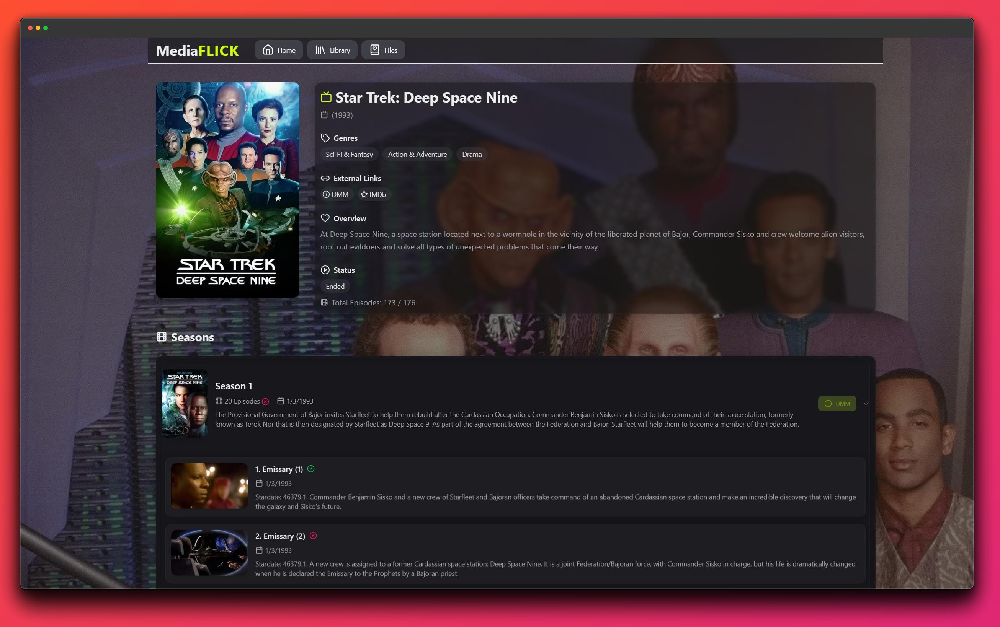

# MediaFlick



## Description

MediaFlick is a media management tool that allows you to scan your media library and automatically organize your files into folders based on their metadata. It uses the TMDb API to get information about movies and TV shows, and it can also detect and rename files based on their metadata.

## Installation

MediaFlick consists of two components: a backend service (.NET) and a frontend web application (Next.js). Both need to be installed and running for the application to work properly.

### Backend Installation

1. Download the appropriate backend package for your operating system from the [latest release](https://github.com/phob/mediaflick/releases/latest):
   - For Windows: `mediaflick-backend-windows.zip`
   - For Linux: `mediaflick-backend-linux.tar.gz`

2. Extract the archive to your desired location:
   - Windows:
     ```powershell
     Expand-Archive mediaflick-backend-windows.zip -DestinationPath C:\mediaflick
     ```
   - Linux:
     ```bash
     mkdir -p /opt/mediaflick
     tar -xzf mediaflick-backend-linux.tar.gz -C /opt/mediaflick
     ```

3. Start the backend service:
   - Windows:
     ```powershell
     cd C:\mediaflick
     .\PlexLocalScan.Api.exe
     ```
   - Linux:
     ```bash
     cd /opt/mediaflick
     chmod +x PlexLocalScan.Api
     ./PlexLocalScan.Api
     ```

### Frontend Installation

1. Download the frontend package `mediaflick-frontend.zip` from the [latest release](https://github.com/phob/mediaflick/releases/latest)

2. Extract the archive to a web server directory:
   - For nginx:
     ```bash
     unzip mediaflick-frontend.zip -d /var/www/mediaflick
     ```
   - For Apache:
     ```bash
     unzip mediaflick-frontend.zip -d /var/www/html/mediaflick
     ```

3. Configure your web server to serve the Next.js application. Example nginx configuration:
   ```nginx
   server {
       listen 80;
       server_name mediaflick.local;
       root /var/www/mediaflick;
       
       location / {
           try_files $uri $uri/ /_next/static/$uri /_next/static/$uri/ =404;
       }
       
       location /_next/ {
           alias /var/www/mediaflick/_next/;
       }
   }
   ```

4. Access the application through your web browser at `http://localhost` or your configured domain.

## Configuration

After installation, you'll need to configure both components:

1. Backend configuration file is located at:
   - Windows: `C:\mediaflick\appsettings.json`
   - Linux: `/opt/mediaflick/appsettings.json`

2. Frontend configuration can be done through the web interface under Settings.

For detailed configuration options, please refer to the [Configuration Guide](docs/configuration.md).
